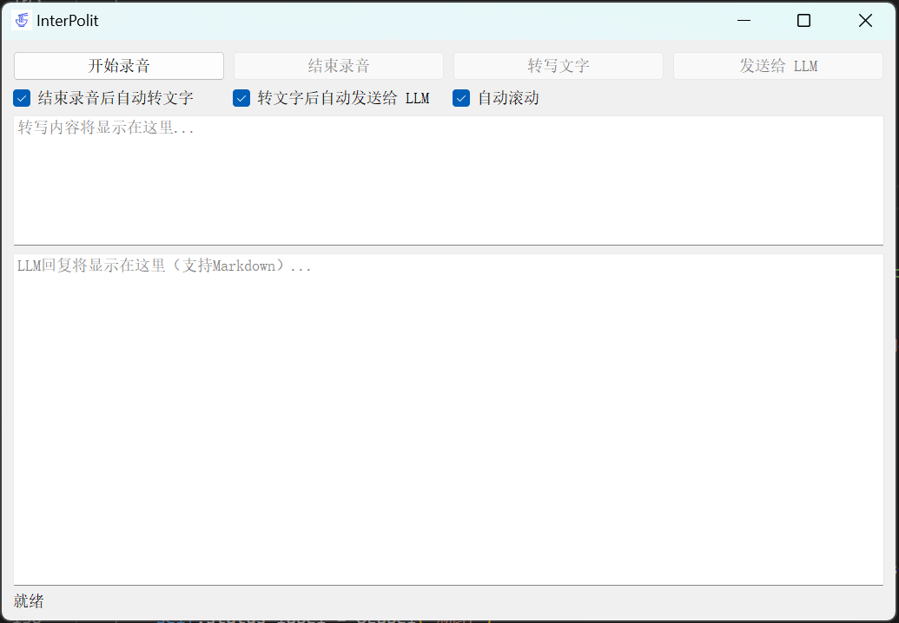
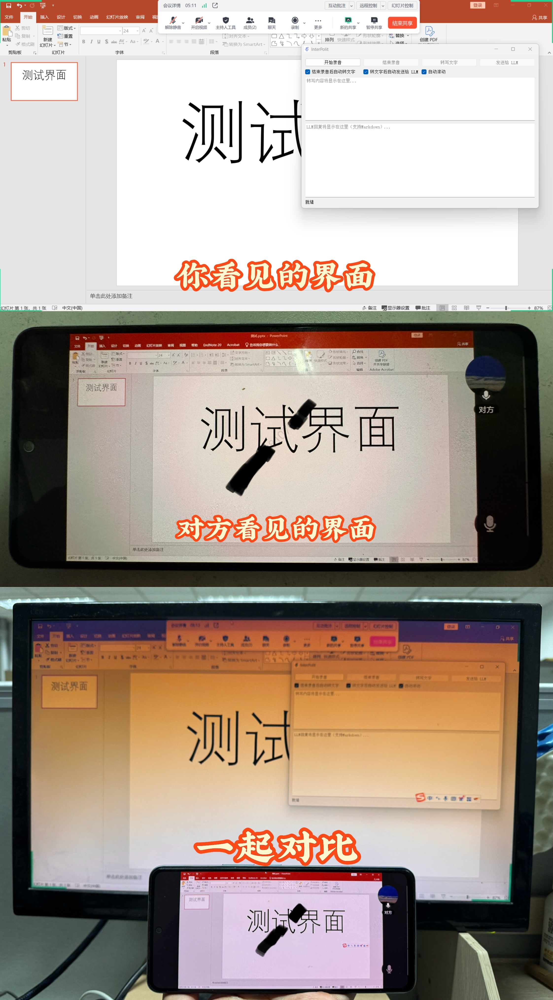

# InterPilot

[English](README_en.md) | [中文](README.md)

[](https://www.microsoft.com/windows)
[](https://creativecommons.org/licenses/by-nc/4.0/)
[](https://www.python.org/)
[](https://pypi.org/project/PyQt5/)
[](https://www.ffmpeg.org/)
[](https://www.openai.com/)
[](https://cloud.siliconflow.cn/i/TzKmtDJH)

本项目是一个基于 AI 的助手工具，能够从windows的输入输出设备中捕获音频，将音频转为文字后，再调用 LLM（大语言模型） API 给出回答。项目主要包括录音、转写和 AI 回答三个模块，**旨在为个人的正当学习、工作、科研提供辅助支持。**

部分内测用户反映，本工具可能可以在面试、会议、学习等场景中提供一定的帮助，比如在在线会议软件中作为AI面试工具辅助面试：获取面试官的音频然后得到回答，但是请注意：**本工具仅供学习交流使用，不得用于任何不正当用途**。

经测试，本工具能够借助第三方工具隐藏界面以防止被录屏软件、屏幕共享等功能录制到，但工具本身不具备隐藏界面的功能。**是否使用第三方工具与作者无关，风险由用户自行承担。**


## 特性

- **音频捕获**  
  使用 [LoopbackRecorder](src/audio_capture.py) 从系统录制音频（**支持 loopback 设备**），并保存为 WAV 文件。

- **语音转写**  
  基于 [Whisper](https://github.com/openai/whisper) 模型在**本地进行音频转写**，支持多种模型规格（默认使用 `base` 模型）。

- **AI 辅助回答**  
  通过调用 LLM API（配置在 `config.ini` 中）对转写后的文本进行分析，生成回答。支持**流式返回并实时更新界面**。

- **图形用户界面**  
  基于 PyQt5 构建的简洁 GUI，支持录音、转写、发送文本至 LLM 等操作，并对 LLM 回复**支持 Markdown 渲染**。



## 项目结构

```
C:.
│   config.ini
│   logo.png
│   main.py
|   main_cmd.py
|   README.md
│   requirements.txt
│
├── output
└── src
    │   audio_capture.py
    │   llm_client.py
    │   transcriber.py
    │   __init__.py
    │
    └── utils
        │   config_loader.py
        │   __init__.py
```

- **config.ini**  
  配置文件，包含 API 接口地址、API key、使用的模型、设备索引、默认提示词等参数。

- **logo.png**  
  应用程序图标（用于 GUI 窗口）。

- **main.py/main_cmd.py**  
  程序入口，负责启动图形界面和整体工作流程。

- **output/**  
  存放录音文件。

- **requirements.txt**  
  列出项目依赖的 Python 包（例如 PyQt5、markdown2、whisper、openai 等）。

- **src/**  
  存放核心模块：  
  - `audio_capture.py`：音频录制模块。   
  - `transcriber.py`：语音转写模块。  
  - `llm_client.py`：调用 LLM API 的客户端。 
  - `utils/`：包含一些工具类和配置加载模块。

## 安装与依赖

### 系统依赖

- **FFmpeg**  
  本项目依赖 [FFmpeg](https://www.gyan.dev/ffmpeg/) 进行部分音频处理，请确保已正确安装并配置环境变量。  
  - **安装方法示例**： 
    - Windows 用户： 
      - 使用 [Scoop](https://scoop.sh/)：  
        ```bash
        scoop install ffmpeg
        ```  
      - 或下载 Windows 预编译版本（[下载链接](https://www.gyan.dev/ffmpeg/builds/ffmpeg-release-full.7z)）
      - 将下载目录下的 `bin` 文件夹（例如 `C:\Users\USERNAME\scoop\apps\ffmpeg\7.1.1\bin`）添加到系统环境变量 `PATH` 中。
    - Mac 用户可使用 Homebrew 安装：  
      ```bash
      brew install ffmpeg
      ```
    - whisper项目提到`You may need rust installed as well`,所以需要可能安装rust（但不安装好像没事儿，建议先不装，如果`transcriber.py`不能正常运行再参考[Whisper](https://github.com/openai/whisper) ）
     


### Python 依赖

建议使用miniconda或者anaconda创建虚拟环境（建议安装 `Python 3.10`版本）：

```bash
conda create -n interview python=3.10
conda activate interview
```

然后使用以下命令安装项目所需依赖：
  
```bash
pip install -r requirements.txt
```


## 配置

请根据实际情况修改根目录下的 `config.ini` 文件，其中包括：

- **API_URL**：LLM API 的地址。  
- **API_KEY**：访问 API 的密钥。  
- **MODEL**：调用的模型名称（例如 `deepseek-ai/DeepSeek-R1-Distill-Qwen-7B`，其他模型名称可以访问硅基流动（[官网链接](https://cloud.siliconflow.cn/i/TzKmtDJH)）-模型广场查看。  
- **SPEAKER_DEVICE_INDEX** 与 **MIC_DEVICE_INDEX**：录音设备的索引，视具体系统配置而定。
- **OUTPUT_DIR**：存储录音文件的目录。  
- **WHISPER_MODEL_SIZW**：[whisper](https://github.com/openai/whisper)模型的大小，可选项为tiny `base`、`small`、`medium`、`large`、`turbo`。
- **DEFAULT_PROMPT**：发送给 LLM 的默认提示词，可根据面试场景调整。

### 具体配置说明

#### API
- 建议注册硅基流动（[官网链接](https://cloud.siliconflow.cn/i/TzKmtDJH)）获取`API_KEY`，新用户受邀可获取14元额度（邀请码`TzKmtDJH`），足够用一段时间了
- 官网左侧菜单栏-API秘钥-新建API秘钥-获取一段形如`sk-xxxxxxxxxxxxxxxxxxxxxxxxxxxxx`的长字符串替换`config.ini`里的`API_KEY`即可
- **使用其他支持OpenAI API的服务也可以**，只需替换`API_URL`和`API_KEY`即可（还是建议使用siliconflow，工具默认使用的`deepseek-ai/DeepSeek-R1-Distill-Qwen-7B`模型完全免费，白嫖万岁！）

#### 录音设备索引
- 默认`SPEAKER_DEVICE_INDEX`置为了-1，这会自动寻找可用的默认wasapi_loopback设备，一般录制的就是你的目前的扬声器（耳机）听到的声音，但如果出现问题，建议手动运行`audio_capture.py`查看全部可用设备后，手动指定正确的设备。你也可以通过修改这个参数使得录制的是麦克风输入的声音。

```bash
python src/audio_capture.py
```

## 使用说明

### 1. 单独测试模块

项目各核心模块（录音、转写、LLM 客户端）均包含简单的测试代码。你可以分别运行下列文件，检查各功能模块是否正常运行：

- `src/audio_capture.py`  —— 用于实现音频录制功能（能够打印出系统中的音频设备列表）。
- `src/transcriber.py`  —— 用于实现音频转写功能（首次运行会自动下载模型）。
- `src/llm_client.py` —— 用于实现 LLM 客户端功能（调用 LLM API 并返回回答）。


### 2. 启动图形界面

运行 `main.py` 启动完整的面试助手 GUI：


```bash
python main.py
```

在 GUI 中你可以依次进行以下操作：

- **开始录音**：点击“开始录音”按钮，程序将自动生成唯一的录音文件名并开始录制音频。  
- **结束录音**：点击“结束录音”按钮结束录音，录音文件保存在 `output` 目录中。  
- **转写文字**：录音结束后（或手动点击），调用转写模块，将录音转为文字并显示在界面上。  
- **发送给 LLM**：转写完成后，可以将文字发送至 LLM，生成 AI 回答，并在界面上显示支持 Markdown 格式的回复。
- **修改转写文字并发送给 LLM**

如果你想在终端中运行，可以使用 `main_cmd.py`：

```bash
python main_cmd.py
```

### 3. 注意事项

- **录音设备**：根据设备不同，可能需要调整 `config.ini` 中的 `SPEAKER_DEVICE_INDEX` 和 `MIC_DEVICE_INDEX` 参数。  
- **环境变量**：确保 FFmpeg 已安装并已添加到环境变量 PATH 中，否则可能会影响音频处理。  
- **测试验证**：建议先单独测试各模块，确认音频录制、转写和 LLM 回答均正常后再启动 GUI 整体运行。

### 4. 应对在线会议等软件的屏幕共享功能（如果你不想让别人看到本工具）

使用[shalzuth/WindowSharingHider](https://github.com/shalzuth/WindowSharingHider)隐藏UI界面————太棒的工具了！又方便又好用！

任务栏中图表的隐藏:
- 直接使用windows自带的任务栏隐藏功能，或者干脆把任务栏移到第二个显示器
- 使用一些隐藏工具（可以自己找一下）

使用[turbotop](https://www.savardsoftware.com/turbotop/)可以使得窗口始终置顶————也是很好用的工具

- **注意一下使用顺序不然可能会出现问题**：
  - 先使用turbotop使得窗口置顶
  - 再使用WindowSharingHider隐藏UI界面
  - 如果不太就行就换一下顺序多试几下



## 待补充 / TODO
  
- [ ] 在README中增加详细的使用案例或截图（GUI 操作示例、终端输出示例等）。  
- [ ] 增加voice_generate功能（TTS）——已经测试好，待集成
- [ ] 增加麦克风扬声器音频共同识别功能
- [ ] 任务栏中的图标隐藏功能

## 贡献

欢迎社区开发者提交 issue 或 pull request，一起完善这个 工具。如果有任何建议或改进意见，请随时联系。

## 灵感

来源于[YT-Chowww/InterviewCopilot](https://github.com/YT-Chowww/InterviewCopilot)

## ⚠️ 免责声明 / Disclaimer

本项目仅供技术学习与研究交流之用，严禁用于以下用途：
- 任何形式的求职面试作弊行为
- 侵犯他人隐私或商业秘密
- 违反当地法律法规的行为

使用者应对自身行为负全部法律责任，作者不承担任何因滥用本项目导致的直接或间接后果。使用即表示您已阅读并同意本声明。

## 许可证
本项目采用 [Creative Commons Attribution-NonCommercial 4.0 International (CC BY-NC 4.0)](https://creativecommons.org/licenses/by-nc/4.0/) 许可证进行开源。  
这意味着您可以自由地共享和修改本项目的内容，但**仅限于非商业用途**。  


