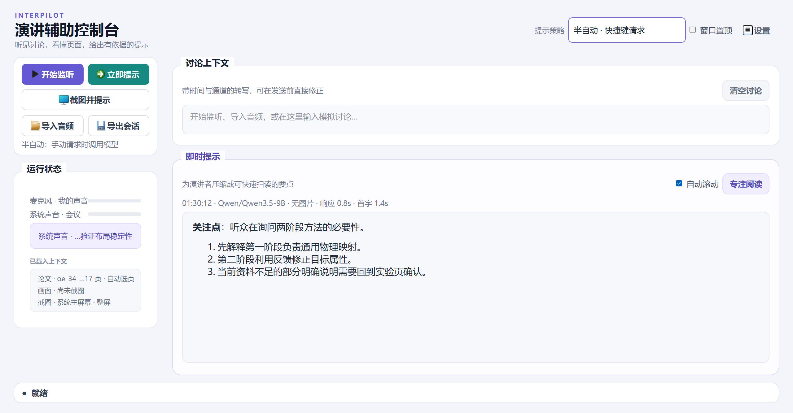

# InterPilot

[English](README_en.md) | 中文

InterPilot 是面向论文分享、会议和讨论的 Windows 桌面助手。它可以分别采集麦克风与系统声音，持续转写讨论，并结合当前幻灯片截图和论文 PDF，生成适合演讲者快速阅读的回答提示。

> 使用者应确保音频采集、转写和资料上传符合会议规则、参与者知情要求及当地法律。请使用耳机，并确保所选系统输出设备主要播放会议声音；关闭无关视频和通知声音。

## 已实现能力

- 麦克风与 WASAPI 系统回环可独立启用、选择设备和查看音量。
- 本地 Whisper 或 SiliconFlow 云端语音转写；本地模式可边说边显示临时结果，停顿后用完整分段校正。
- 半自动模式：持续转写，按按钮或全局快捷键请求提示。
- 自动模式：仅在出现新的问题、质疑或相关讨论时检查并给出提示。
- 导入论文 PDF，按页面提取相关内容；回答要求标注文件名和 PDF 物理页码。
- 可预先选择指定显示器，快捷键直接截取整屏；也可切换为每次框选区域，再连同讨论和论文摘录发给视觉模型。
- 设置窗口统一配置 API、模型、提示词、音频设备、论文、初始图片、截图策略和快捷键；支持 SiliconFlow 及本机 OpenAI 兼容接口，主界面只保留演讲时需要的操作。
- 模型列表可从 API 获取、搜索和下拉选择；默认关闭深度思考以降低首字延迟，也可手动启用并限制思考 token。
- API key 为可选项；本地服务可留空，远程密钥可用 Windows DPAPI 按当前账户加密保存在本机，不写入 JSON 或 Git。
- 流式回答、连接复用、首字/总耗时显示、取消请求、会话导出与论文页码优先指定。
- 即时提示默认占据主要空间；可拖动上下分隔线，或启用“专注提示”隐藏侧栏与讨论区。
- 专注阅读时可选择保留讨论；实时识别摘要保持固定高度，不会随临时文本伸缩界面。
- 可切换窗口置顶，便于在演讲或会议窗口上方查看短提示。

默认回答与视觉模型为 `Qwen/Qwen3.8-27B`。模型权限和能力以账户实际可用列表为准；可在设置中测试连接、刷新列表或直接填写模型 ID。SiliconFlow 的 OpenAI 兼容接口支持用 base64 图片调用视觉模型，详见其[视觉输入文档](https://docs.siliconflow.cn/docs/userguide/capabilities/vision)。



## 推荐的论文分享流程

1. 戴上耳机并关闭通知声音，确保系统回环主要包含线上会议声音。
2. 在“设置”中选择论文 PDF、麦克风和正在使用的耳机回环设备。
3. 选择正在共享 PPT 的显示器，并将截图方式设为“整屏”。
4. 先使用半自动模式，开始监听后用 `Ctrl+Alt+Enter` 请求提示。
5. 翻页后用 `Ctrl+Alt+S` 直接截取已设置的显示器并立即请求提示。
6. 设备和提示效果稳定后，再切换到自动模式。

一张清晰的 PPT 截图足以测试视觉问答链路。截图不会自动随 PPT 翻页更新，所以正式演讲中仍需按快捷键刷新；后续可增加低频自动截图与页面变化检测。

## 默认全局快捷键

| 功能 | 快捷键 |
| --- | --- |
| 开始 / 暂停监听 | `Ctrl+Alt+R` |
| 立即生成提示 | `Ctrl+Alt+Enter` |
| 截取预设屏幕并提示 | `Ctrl+Alt+S` |
| 显示 / 隐藏窗口 | `Ctrl+Alt+H` |

快捷键被其他程序占用时，InterPilot 会显示提示；可在设置中修改。快捷键需要至少一个 `Ctrl`、`Alt`、`Shift` 或 `Win` 修饰键。

## 安装与启动

建议使用 Python 3.10 和独立环境：

```powershell
conda create -n interpilot python=3.10
conda activate interpilot
pip install -r requirements.txt
python main.py
```

本地 Whisper 需要 FFmpeg。Windows 可以使用 Scoop 安装：

```powershell
scoop install ffmpeg
```

第一次使用某个 Whisper 模型时会下载模型文件。若不希望下载或本机算力有限，可在设置中改为云端转写；云端转写会上传分段音频。

## 首次配置

1. 打开“设置”，填写 API 地址、模型 ID；使用远程服务时再填写 API key。
2. 远程密钥可勾选“用 Windows 账户加密后保存在本机”，或仅在本次运行中使用。也可设置环境变量 `SILICONFLOW_API_KEY`。
3. 点击“获取可用模型并选择”，确认服务可访问回答模型；若服务没有实现 `/models`，可直接填写模型 ID。
4. 根据语言与算力选择本地 Whisper 模型；`base` 适合功能验证，正式使用可按延迟和准确率调整。
5. 在“音频与转写”中刷新设备，系统声音选择名称带 `[Loopback]` 的耳机或扬声器设备。
6. 在“材料与截图”中选择论文和共享 PPT 的显示器；双屏演讲推荐使用整屏截图。

程序的普通设置存放在被 Git 忽略的 `config.local.json`；加密密钥存放在 `config.key`。仓库中的 `config.ini` 只用于兼容旧版本，不能存放真实密钥。

### 本地 OpenAI 兼容接口

只要本地模型服务实现 OpenAI 兼容的 Chat Completions 接口，就可以不使用 API key。例如：

```text
API 地址: http://localhost:8000/v1
API key:  留空
模型 ID:  填写本地服务实际暴露的名称
```

地址应包含服务要求的 `/v1` 路径。模型列表按钮依赖 `GET /models`；未实现该接口时不影响手动输入模型 ID。发送截图还要求本地模型及服务支持 OpenAI 风格的图片输入；使用纯文本模型时，请在“材料与截图”中清空初始参考图片，并避免使用“截图并提示”。

如果密钥曾提交或发送到不可信位置，应在服务商控制台撤销并重新生成。即使从当前版本删除，密钥仍可能留在 Git 历史中。

## 数据与隐私

- 本地 Whisper：音频只在本机转写；分段临时 WAV 在处理完成后删除。
- 云端转写：分段音频发送到配置的 API 服务。
- 请求提示：最近讨论、选中的论文摘录和当前截图会发送到配置的回答模型。
- 论文 PDF 在本机提取文字，不会整份直接上传；被选中的页面摘录会进入请求。
- 导出的会话可能包含讨论与模型回答，请自行选择安全的保存位置。

音频标签表示采集通道，不等同于可靠的说话人身份：“麦克风”通常是本地声音，“系统声音”通常是远端会议与系统播放内容。

## 命令行诊断

列出设备：

```powershell
python main_cmd.py --list-devices
```

仅测试本地转写：

```powershell
python main_cmd.py --audio output/test_record.wav --transcribe-only
```

用论文、截图和问题发起一次请求：

```powershell
python main_cmd.py --paper pre/paper.pdf --image pre/slide.png --question "结合当前页说明两个阶段的作用"
```

## 测试

```powershell
pip install -r requirements-dev.txt
python -m pytest -q
python -m compileall -q main.py main_cmd.py src
python -m ruff check main.py main_cmd.py src tests
```

自动化测试覆盖设置脱敏、Windows DPAPI、快捷键、音频断句、PDF 页码检索、图片消息、请求取消和离屏 UI。音频硬件仍需在目标耳机与麦克风上做一次人工验收。

## 当前限制与后续方向

- 当前使用本地关键词选页，适合短论文；更长的资料可进一步加入向量索引和跨文档检索。
- PDF 引用使用文件的物理页码，可能与论文印刷页码不同。
- 扫描版 PDF 需要先 OCR。
- 自动模式依据提示词判断是否需要回应，仍可能误触发；建议正式分享前用真实材料校准。
- 截图是固定画面，不会自动检测 PPT 翻页；每次按截图快捷键会替换当前画面。
- 临时转写会优先降低可见延迟，但内容可能变化；停顿后的完整分段才进入自动提示判断。
- 同一路系统声音可能包含通知或视频，第一版由用户通过耳机与系统设置控制输入内容。

## 许可证

本项目采用 [CC BY-NC 4.0](https://creativecommons.org/licenses/by-nc/4.0/) 许可证，仅限非商业用途。
